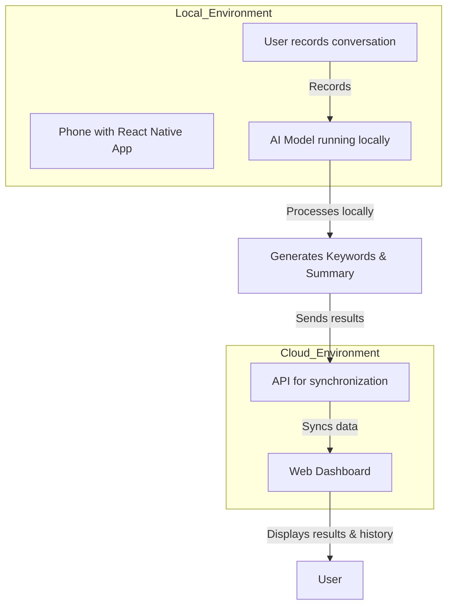

# **FastExtraction - Local AI for Mobile Phones**

## **📌 Overview**

**FastExtraction** is a lightweight AI-powered tool that extracts relevant keywords and generates summaries from conversations. Designed for mobile phones, it operates entirely **locally via a React Native app**, ensuring privacy and offline functionality.

Built with **React Native** and powered by **Hugging Face's NLP models**, this tool delivers accurate keyword extraction and conversation summaries for professional and personal use cases.

---

## **✨ Features**

✅ **Privacy-First** – All processing happens locally; no data leaves your device.
✅ **Mobile-Optimized** – Runs efficiently on modern smartphones.
✅ **No Internet Required** – Works completely offline.
✅ **Intuitive Workflow** – Record, analyze, and access results effortlessly.
✅ **Integration with Web Dashboard** – Syncs with a dashboard to view summaries, keywords, and history.

---

## **🚀 Quick Start**

### **Where**

* **React Native App** (iOS/Android)
* **Web Dashboard**

### **Installation**

1. **Clone the repository**

   ```bash
   git clone git@github.com:OoscarFrank/FastExtraction.git
   cd FastExtraction
   ```

2. **Setup the React Native environment**

   Follow the [React Native environment setup guide](https://reactnative.dev/docs/environment-setup) for your platform.

3. **Install dependencies and run the app**

   ```bash
   npm install
   npm run start
   npm run android # or npm run ios
   ```

4. **Run the web dashboard (optional)**

   ```bash
   cd dashboard
   npm install
   npm run start
   ```

5. **Run the api (optional)**
```bash
   cd api
   install -r requirements
   python3 api.py
```

---

## **🔧 Steps**

1. Open the app and record a conversation.
2. The AI processes the conversation locally, extracting keywords and generating a summary.
3. View the results directly in the app or sync them with the web dashboard.
4. Access the history of processed conversations via the dashboard.

---

# Interaction Diagram: AI Model on Mobile and Web Dashboard



---

## **📜 License**

MIT License. See [LICENSE](LICENSE) for details.

---

## **📬 Contact & Support**

* **Names**:

  * Oscar FRANK
  * Younès BOUFRIOUA
  * Théotime SCHMELTZ

---

## **🔗 Useful Links**

* [React Native Documentation](https://reactnative.dev/)

---

**🎉 Happy FastExtraction!** 🚀
