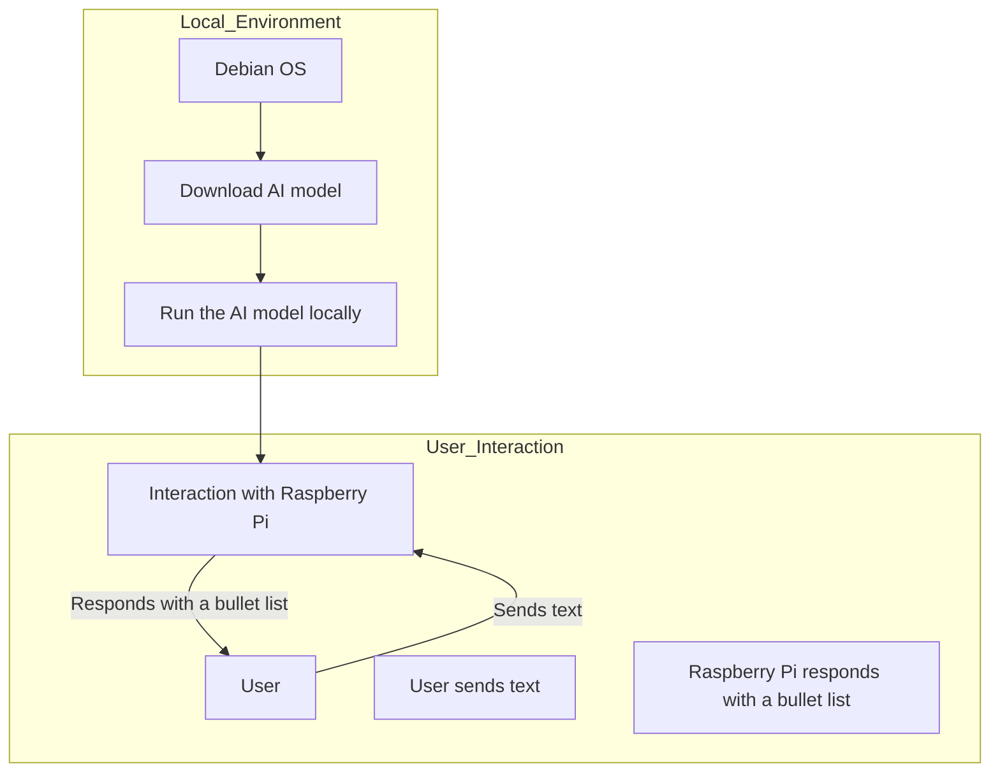

# Interaction Diagram: AI Model on Debian and Raspberry Pi

### Description

1. **Local Environment**:

   - A Debian OS is used to download an AI model from the Internet.
   - Once downloaded, the model is executed locally.

2. **User Interaction**:
   - The user interacts with a Raspberry Pi by sending text.
   - The Raspberry Pi processes the text, uses the AI model, and responds with a bullet list.
